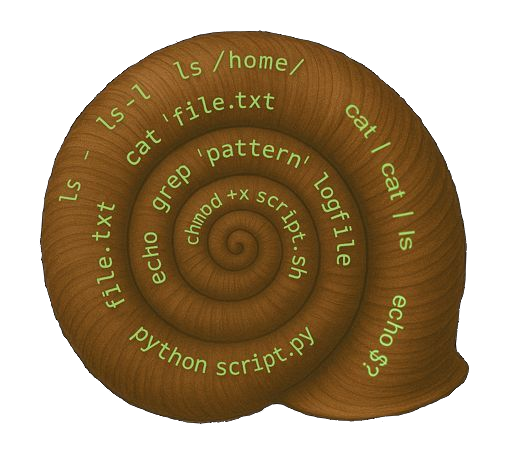

<div align="center">
  <h2>minishell - 42 project</h2>
  
  <br>
</div>


> A reimplementation of a minimalist UNIX shell in C, developed as part of the **École 42** curriculum.  
> The goal is to understand the low-level mechanisms of a shell (fork, exec, pipes, signals...).

---

## 📖 Table of Contents
- [Description](#-description)
- [Features](#-features)
- [Installation](#%EF%B8%8F-installation)
- [Usage](#-usage)
- [Project Structure](#-project-structure)
- [Examples](#-examples)
- [Roadmap](#-roadmap)
- [Credits](#-credits)
- [License](#-license)

---

## 📝 Description
`minishell` is a simplified shell that mimics the behavior of `bash`.  
It can execute commands, handle redirections, pipes, and several builtins.

---

## ✨ Features
- ✅ Execute commands using `execve`
- ✅ Pipe handling `|`
- ✅ Redirections `>`, `<`, `>>`
- ✅ Environment variables
- ✅ Signal handling (`Ctrl-C`, `Ctrl-D`, `Ctrl-\`)
- ✅ Builtins (`cd`, `echo`, `pwd`, `export`, `unset`, `env`, `exit`)
<!-- - 🚧 Advanced expansions (in progress) --> 

---

## ⚙️ Installation
Requirements:  
- OS: Linux or macOS  
- C compiler (gcc, clang)  
- `make`

```bash
git clone https://github.com/<your-username>/minishell.git
cd minishell
make
./minishell
```

---

## 🖥 Usage
Example run:

```bash
$ ./minishell
minishell> echo "Hello World"
Hello World
minishell> ls -l | grep minishell > output.txt
minishell> exit
```

---

## 📂 Project Structure

```
.
├── bin/                # Content for README
├── libft/              # Autorized functions library
├── srcs/               # Source code (.c)
├── subject_and_doc/    # Project 42 subject
├── Makefile
├── README.md
├── fshell.sh            # Script to run Valgrind (Linux)
├── minishell.h          # Header files (.h)
└── readline_leaks.supp  # arguments to ignore readline known leaks with Valgrind
```

---

## 🔎 Examples
- `ls -la | grep .c > sources.txt`
- `echo "Hello $USER"`
- `cat < input.txt | grep error >> log.txt`

---

## 🚀 Roadmap
<!-- - [ ] Add logical operators `&&` and `||`
- [ ] Add command history
- [ ] Implement auto-completion -->

There's no implementation in sight at this time.

---

## 👤 Credits
Project developed by :
- **Loïc Gérard** – 📧 Contact: lgerard@studend.42perpignan.fr - [École 42 Perpignan](https://42perpignan.fr).
- [**Greg197819**](https://github.com/Greg197819).

---

## 📜 License
This project is licensed under the MIT License. You are free to use, modify, and distribute it.

> ⚠️ **Note for students**  
> If you are a student at 42 (or elsewhere), it is strongly recommended **not to copy/paste** this code.  
> Instead, try to **write your own solution** — it’s the only way to really learn and succeed.
