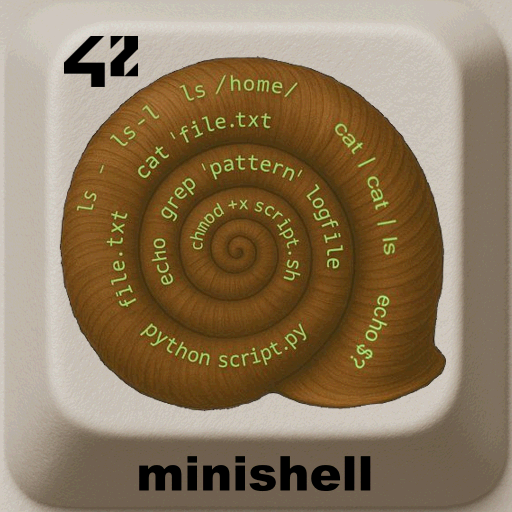

<div align="center">
  <h2>minishell - 42 project</h2>
  
  <br>
</div>


> A reimplementation of a minimalist UNIX shell in C, developed as part of the **École 42** curriculum.  
> The goal is to understand the low-level mechanisms of a shell (fork, exec, pipes, signals...).

---

## 📖 Table of Contents
- [Description](#-description)
- [Features](#-features)
- [Installation](#-installation)
- [Usage](#-usage)
- [Project Structure](#-project-structure)
- [Examples](#-examples)
- [Roadmap](#-roadmap)
- [Credits](#-credits)
- [License](#-license)

---

## 📝 Description
`minishell` is a simplified shell that mimics the behavior of `bash`.  
It can execute commands, handle redirections, pipes, and several builtins.

---

## ✨ Features
- ✅ Execute commands using `execve`
- ✅ Pipe handling `|`
- ✅ Redirections `>`, `<`, `>>`
- ✅ Environment variables
- ✅ Signal handling (`Ctrl-C`, `Ctrl-D`, `Ctrl-\`)
- ✅ Builtins (`cd`, `echo`, `pwd`, `export`, `unset`, `env`, `exit`)
- 🚧 Advanced expansions (in progress)

---

## ⚙️ Installation
Requirements:  
- OS: Linux or macOS  
- C compiler (gcc, clang)  
- `make`

```bash
git clone https://github.com/<your-username>/minishell.git
cd minishell
make
./minishell
```

---

## 🖥 Usage
Example run:

```bash
$ ./minishell
minishell> echo "Hello World"
Hello World
minishell> ls -l | grep minishell > output.txt
minishell> exit
```

---

## 📂 Project Structure

```
.
├── include/        # Header files (.h)
├── src/            # Source code (.c)
│   ├── builtins/
│   ├── exec/
│   ├── parsing/
│   ├── utils/
├── Makefile
└── README.md
```

---

## 🔎 Examples
- `ls -la | grep .c > sources.txt`
- `echo "Hello $USER"`
- `cat < input.txt | grep error >> log.txt`

---

## 🚀 Roadmap
- [ ] Add logical operators `&&` and `||`
- [ ] Add command history
- [ ] Implement auto-completion

---

## 👤 Credits
Project developed by **Loïc Gérard** – [École 42 Perpignan](https://42perpignan.fr).  
📧 Contact: loic.gerard4@…  

---

## 📜 License
This project is licensed under the MIT License. You are free to use, modify, and distribute it.

